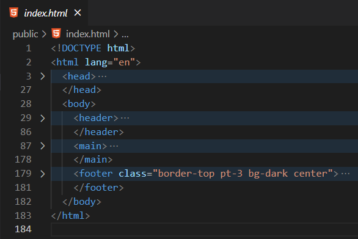
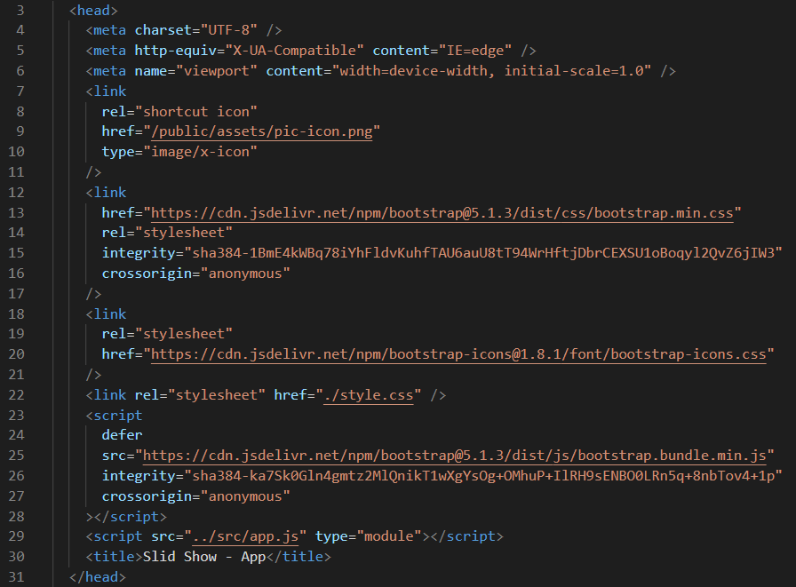
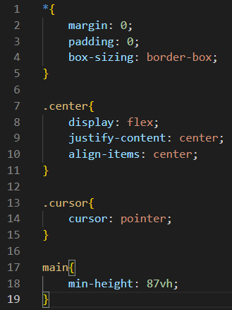
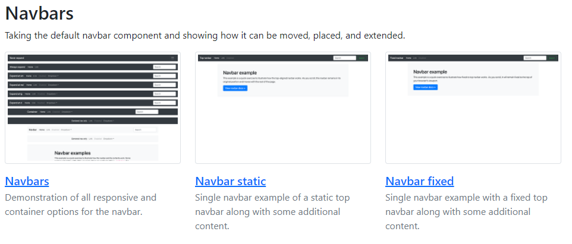
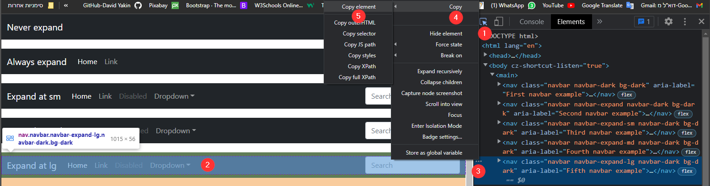
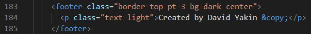
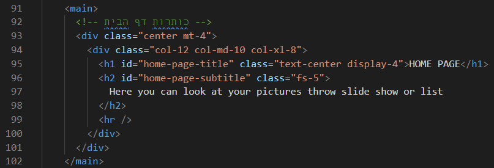

## שלב ג: עימוד בסיסי באתר (Layout)

### קובץ `index.html`

בתגית ה-head נשים את ה-metadata:

    * קישורים לקבצי העיצוב, לוגיקה וספריות חיצוניות
    * הגדרות המתייחסות לשינויים בגודל מסך
    * הגדרות נגישות

תגית body – תוכן שהגולש יוכל לראות: 

    * תפריטי ניווט – `header`
    * תוכן דינאמי המתחלף – `main`
    * כותרת תחתית –  `footer`

### תגית `head` – metadata

* הגדרות שפה
* התאמות לדפדפנים
* התאמות לגודל מסך
* לינק לאייקון בראש הדף
* לינק לקבצי העיצוב בספריית bootstrap
* לינק לאייקונים בספריית – bootstrap icons
* לינק לקובץ העיצוב המרכזי
* לינק לספריית הלוגיקה של bootstrap
* לינק לקובץ הלוגיקה הראשי (entry point)
* תגית ה - title

### קובץ `style.css` – קובץ הגדרות העיצוב המרכזי של האתר

* הגדרות עיצוב כלליות שמבטלות ערכים דיפולטיביים של מרווחים בין אלמנטים
* מחלקה עיצובית שתמרכז לי כל אלמנט שאשים בתוך המיכל עם המחלקה העיצובית הזאת
* מחלקה עיצובית שתשים ה – cursor מסוג של pointer על כל אלמנט עם המחלקה העיצובית הזאת
* קביעת אורך מסך דיפוליטיבי לתגית ה - main

### תפריט הניווט הראשי של האתר – `header`

מאחר וקישרנו את ספריית bootstrap לפרויקט שלנו אנו יכולים ללכת לאתר של bootstrap ולחפש בדוגמאות עיצוב של תפריט ניווט ראשי

הקישור לדוגמאות באתר bootstrap: https://getbootstrap.com/docs/5.1/examples/ 

נגלול בדף עד שנגיע לכותרת Navbars ונלחץ על הקישור הראשון

נפתח את כלי המפתח ונבחר תפריט ניווט רספונסיבי שמסתיר את התגיות בגודל המסך הרצוי

1. נלחץ על לחצן הבחירה של כלי המפתח בדפדפן
2. נבחר את התפריט הרצוי (לשים לב לבחור את כל האלמנט ולא רק את התוכן שלו)
3. נלחץ על שלושת הנקודות לצד האלמנט הרצוי
4. בתפריט שייפתח נבחר בלשונית copy
5. ואחריה ב – copy element

ככלל לאחר הדבקת אלמנט מועתק ממקור חיצוני אנסה להבין את הקוד שהעתקתי ולשנות אותו בהתאם לאתר שברצוני לבנות.

אתחיל ממחיקת האלמנטים שאין ברצוני להשתמש בהם בתפריט הניווט 

לאחר מכן אוסיף את האלמנטים בתפריט הניווט שאהיה מעוניין שיוצגו לגולש

אתאים את תפריט הניווט לשיטת העבודה ב -SPA :

* את כל תגיות ה - `<a href>` אחליף ל – `span` ואמחק את המאפיין href על מנת שלחיצה על קישור לא תרפרש לי את הדף מחדש, דבר שיכול לגרום לקריאות מיותרות לשרת או לאיבוד מידע במידה ואני לא עובד עם שרת, מאגר מידע או עם ה - localStorage

> **SPA** => **S**ingle **P**age **A**pplication

### כותרת בסוף הדף – `footer`

אני משתמש במחלקות עיצוביות של ספריית bootstrap כדי לעצב את הכותרת בסוף הדף

### התוכן הדינמי באתר – `main`

נוסיף כותרת ראשית ומשנית על מנת לראות את העיצוב של שלושת חלקי הדף: header main footer

התוצאה בדפדפן:

