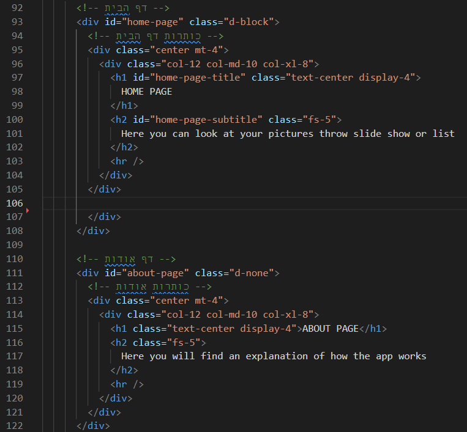
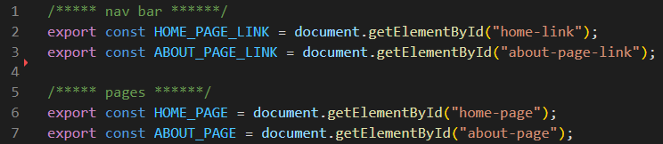
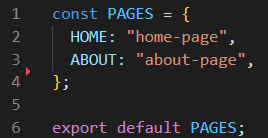
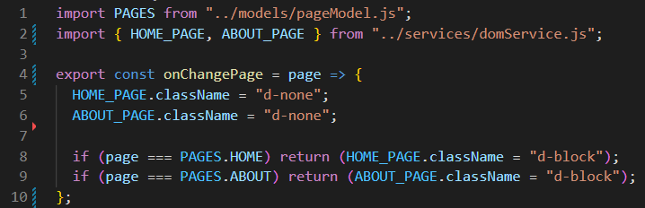
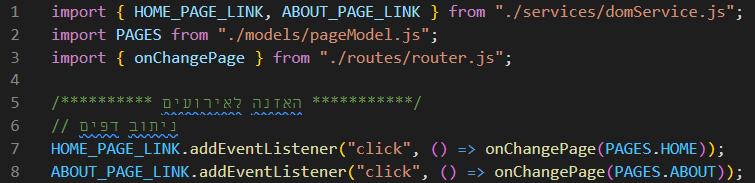

# שלב 4: Routing – ניתוב דפים תוך כדי שמירה על SPA

## חזרות

* אובייקטים
* פונקציות, `return` ו-`undefined`
* event / addEventListener

## module

TODO link to sandbox

* הגדרת module – `script type="module"`
* `export`
* `export default`
* שימוש ב-module – `import`

## חלוקת קובץ ה - HTML לדפים

נעטוף כל חלק שאליו אנו מעוניינים להתייחס כדף באלמנט div וניתן לו id

* עטפנו את דף הבית ב – `div` עם המאפיין `id` שערכו שווה ל `home-page`
* ועטפנו את דף האודות גם כן באלמנט `div` עם המאפיין `id` שערכו `about-page`

לאחר שנתנו גם לתפריטי הניווט מאפיין id ייחודי וגם לדפים נפנה "לתפוס אותם" בקובץ js ייחודי

## תפיסת האלמנטים ב-DOM

ניצור בתיקיית services קובץ חדש בשם domService.js

* נחלק אותו באמצעות הערות לתפיסת אלמנטים לפי הסיווג שלהם
* נתפוס את הלינקים בתפריט הניווט וניתן להם שמות בעלי משמעות 
* נתפוס את ה"דפים" שיצרנו באמצעות מטודת `document.getElementById` וניתן להם שמות משמעותיים
* נייצא כל משתנה באמצעות `export`

## `pageModel.js` – יצירת אובייקט שיאגד בתוכו את שמות הדפים והקישור אליהם

בתוך תיקיית models ניצור קובץ בשם pageModel.js

את האובייקט הזה נייצא מהדף באמצעות export default

## `router.js` – יצירת פונקציה שתנתב בין הדפים

בתוך תיקיית routes ניצור קובץ בשם router.js

נייבא את אובייקט `PAGES`

נייבא את המשתנים שתפסו את הדפים

ניצור את הפונקציה `onChangePage`. הפונקציה תקבל כפרמטר `page`. היא "תכבה" את כל הדפים על ידי הוספת המחלקה העיצובית של bootstrap `"d-none"`.

ניצור התניה שאם הערך של הפרמטר `page` שווה למפתח `HOME` מתוך האובייקט `PAGES` שייבאנו בשורה 2 אז הפונקציה תעצור ותחזיר את החלפת המחלקה העיצובית של המשתנה `HOME_PAGE` ל-`“d-block”` כלומר הדף יוצג לגולש.

אותו הדבר ניצור התניה לדף האודות

## `app.js` – האזנה לאירועים שונים שיפעיל הגולש

נייבא את המשתנים שתפסו את הלינקים בתפריט הניווט

נייבא את אובייקט `PAGES`

נייבא את הפונקציה `onChangePage`

ניצור האזנה לאירוע לחיצת כפתור הן לקישור בתפריט הניווט שאמור להוביל אותנו לדף הבית והן לקישור שאמור להעביר אותנו לדף אודות. 

כאשר האירוע ייקרה תופעל מטודת onChangePage כאשר אני מעביר לה בארגומנט את הקישור לדף הרלוונטי שאליו אני מעוניין להעביר את הגולש. 

כעט אחזור לדף ה – `index.html` ואוודא כי רק דף הבית "דלוק" כלומר שהאלמנט div שעוטף אותו בעל המחלקה העיצובית של bootstrap `"d-block"` וששאר הדפים יהיו ב – `"d-none"`.

## שיעורי בית

* צור קישורים בתפריט הניווט לדפים הבאים: 
    * דף יצירת תמונה חדשה  - ADD PIC
    * דף התחברות - LOGIN
* צור את הדפים:
    * create-pic-page
    * login-page
    * error-404
* צור כותרות מתאימות לדפים שיצרת
* הוסף למודול `pageModel` מפתחות וערכים מתאימים לדפים החדשים
* צור האזנה לאירועים של לחיצת על תפריט הניווט שיוביל לדפים:
    * יצירת תמונה חדשה
    * דף התחברות