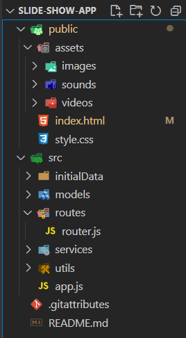
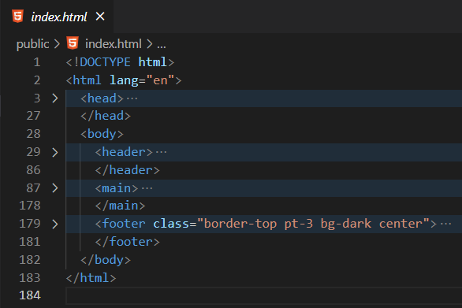

# פרוייקט מצגת תמונות

## שלב א: שלבי תכנון הפרויקט

1. גיבוש רעיון לפרויקט
2. תאור הפרויקט אמתעות דף ועט ומה הלוגיקה העסקית
3. ציור בעפרון איך האפליקציה תראה
4. רפרנס'דוגמאות (מ-Google או מכל מקום אחר)
5. הדמיה - MakeUp
6. פותח את תוכנת הפיתוח VS Code
7. מוריד את התוספים שיעזרו לי לכתוב קוד בצורה מהירה ויוצר snippets
8. מתחיל להעתיק קוד ומתאים אותו לפרוייקט

## שלב ב: ארכיטקטורה בסיסית

`public`:

* `index.html` – קובץ ה – HTML הראשי
* `style.css` – קובץ העיצוב הראשי
* `assets` – בתיקייה זאת נשים את המדיה (קבצי תמונה, וידאו וסאונד)

`src`:

* `initialData` – מידע ראשוני להעלאה למאגר המידע (לרוב יהיה בשרת)
* `models` – אובייקטים ומחלקות שייצרו לנו אוביקטים מסוג מוגדר מראש
* `routes` – ניתוב הדפים (לרוב גם קובץ זה יישב בשרת)
* `services` / `helpers` – פונקציות שמספר קבצים ישתמשו בהם
* `utils` – כלים שיעזרו לנו להתמודד עם אלגוריתמיקה באתר
* `.gitignore` – רשימת קבצים / נתיבים שאין לכלול אותם במערכת בקרת הגרסאות git
* `.gitattributes` – מידע נוסף עבור git
* `README` – קובץ הסבר על הפרוייקט

## שלב ג: עימוד בסיסי באתר (Layout)

### קובץ `index.html`

* בתגית ה-head נשים את ה-metadata:
    * קישורים לקבצי העיצוב, לוגיקה וספריות חיצוניות
    * הגדרות המתייחסות לשינויים בגודל מסך
    * הגדרות נגישות
* תגית body – תוכן שהגולש יוכל לראות: 
    * header – תפריטי ניווט
    * main – תוכן דינאמי המתחלף
    * footer – כותרת תחתית